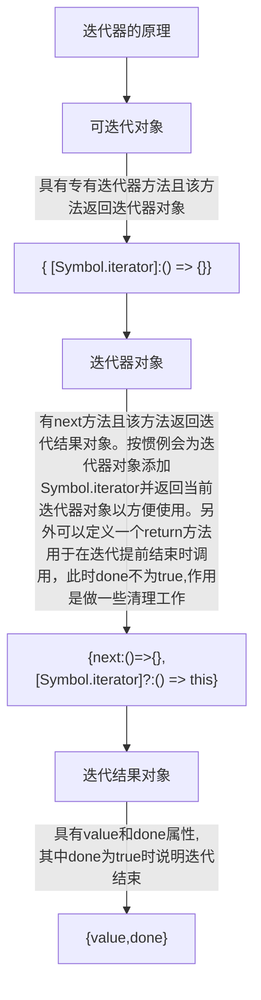

# 迭代器原理

```mermaid
    graph TD
        A[迭代器的原理] --> 
        B["可迭代对象"] --> 
        |具有专有迭代器方法且该方法返回迭代器对象|C["{ [Symbol.iterator]:() => {}}"] -->
        D["迭代器对象"] -->
        |"有next方法且该方法返回迭代结果对象。按惯例会为迭代器对象添加Symbol.iterator并返回当前迭代器对象以方便使用。另外可以定义一个return方法用于在迭代提前结束时调用，此时done不为true,作用是做一些清理工作"|E["{next:()=>{},[Symbol.iterator]?:() => this}"] -->
        F["迭代结果对象"] --> 
        |具有value和done属性,\n其中done为true时说明迭代结束|G["{value,done}"];
```
**可迭代对象和迭代器有一个重要的特性：天性懒惰。相应的计算工作始终会放到实际获取下一个值时进行**